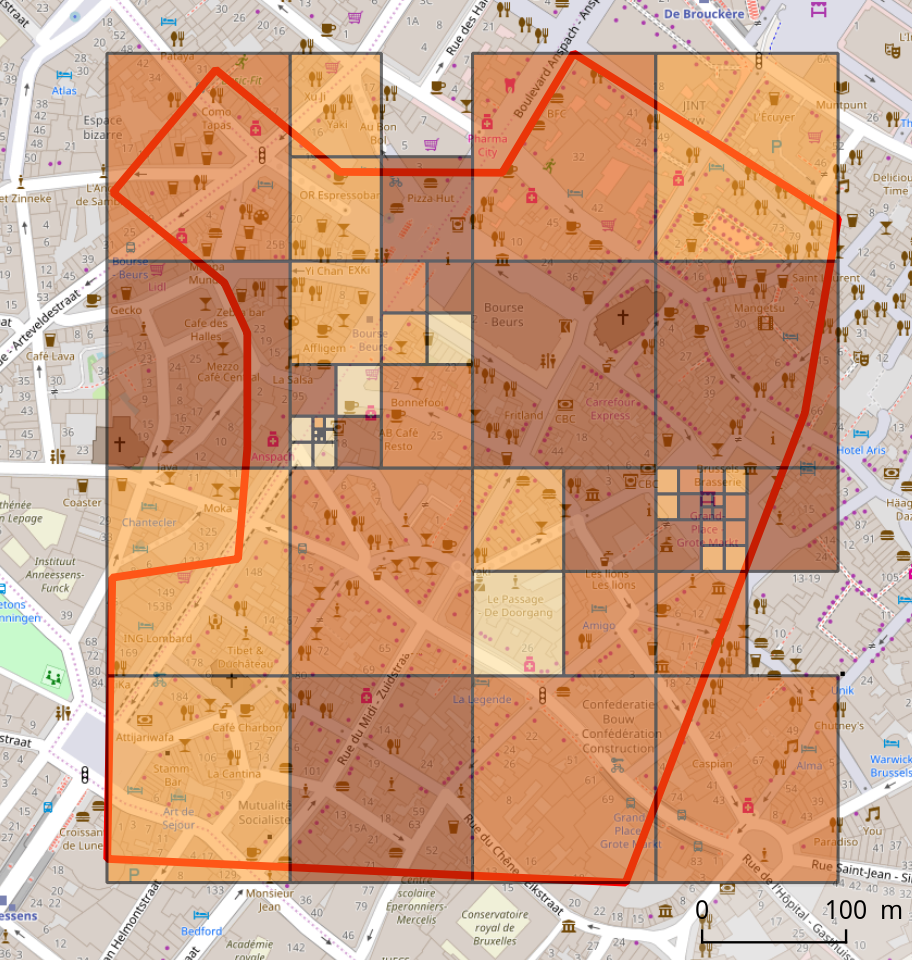

# Flickr Api Scripts
This repository contains python scripts for FlickR API. Information about the API can be found [here](https://www.flickr.com/services/developer/api).  

You must have a Flickr account and get a API key [here](https://www.flickr.com/services/apps/create/).  
 
------

### Extract\_PhotoLocation\_Flickr.py
* The user has to provide the coordinates (minLon, minLat, maxLon, maxLat) of a boundingbox (bbox).
* The script will automatically subdivide the initial bbox into smaller ones which contain maximum 4000 results each (API limit for a bbox request). 
* The script will return as Shapefile :
	* The initial bbox
	* The subdivided bbox
	* The location of photos as point 
* __Example of attribute table:__

|id|accuracy|owner|farm|server|secret|URL_static|URL_websit|
|---|---|---|---|---|---|---|---|
|2147483647|16|83818430@N02|5|4753|e2d3c7011a|https://farm5.staticflickr.com/4753/39896622281_e2d3c7011a.jpg|https://www.flickr.com/photos/83818430@N02/39896622281|
|2147483647|16|70316038@N04|5|4699|ebc0d806f8|https://farm5.staticflickr.com/4699/38928082915_ebc0d806f8.jpg|https://www.flickr.com/photos/70316038@N04/38928082915|
|2147483647|16|27203581@N07|5|4673|43c3a30954|https://farm5.staticflickr.com/4673/28021875079_43c3a30954.jpg|https://www.flickr.com/photos/27203581@N07/28021875079|

* __Example on Royal palace in Brussels:__

Initial box

Subdivided box

Photo locations

**TODO :** 

- Take as input a shapefile with the Area Of Interest (AOI) as polygon, and compute automatically the coordinates of the initial bbox (using shapely).
- After each loop of subdivision of the initial bbox, check if bboxes are completely outside the AOI. If yes, remove them to avoid unnecessary subdivision. 
- Return only photo locations which are completely inside the AOI polygon.
- Return a .csv file with list of distinct user_id that could be used as input in Extract\_InfoUsers\_Flickr.py.

------

### Extract\_InfoUsers\_Flickr.py
* The user has to provide a .csv file with user ids.
* The script will return information about each user (including the place of living if provided in the user profile).

**TODO :** Finish the script and clean up 